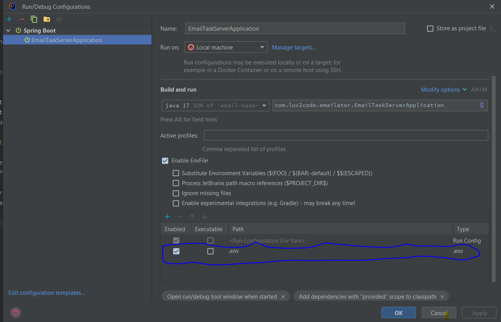

# Development setup

## Run application

Clone the backend repository (`git clone https://github.com/lzugaj/email-task-server.git`).

Open project in Intellij IDEA.

It is necessary to position yourself under the ``support/docker`` folder and
open terminal.

Start docker container ``docker-compose up``

This will start Postgresql database and Rest API service in Docker. 
There is a bash script in the project that creates database when db image 
is creating. After application is started you can try to access some endpoints 
via Postman or frontend application (``yarn start``).

Example: ``http://localhost:8080/api/v1/email-message``

The IP address of the Docker host will always be ``172.17.0.1``. 
If not, then try to find IP address via ``ipconfig`` command.

If IP address still not works then stop all running containers 
(``docker-compose down``) and start just db image (``docker-compose up db``).
In this case you will need to add ``.env`` file in project with
following db properties (``.env`` file is ignored by Git in ``gitignore`` file).

```
EMAIL_TASK_DB_URL=jdbc:postgresql://localhost:5433/email-task
EMAIL_TASK_DB_USERNAME=postgres
EMAIL_TASK_DB_PASSWORD=postgres
```

After that you just need to add ``.env`` file in Server Configuration


